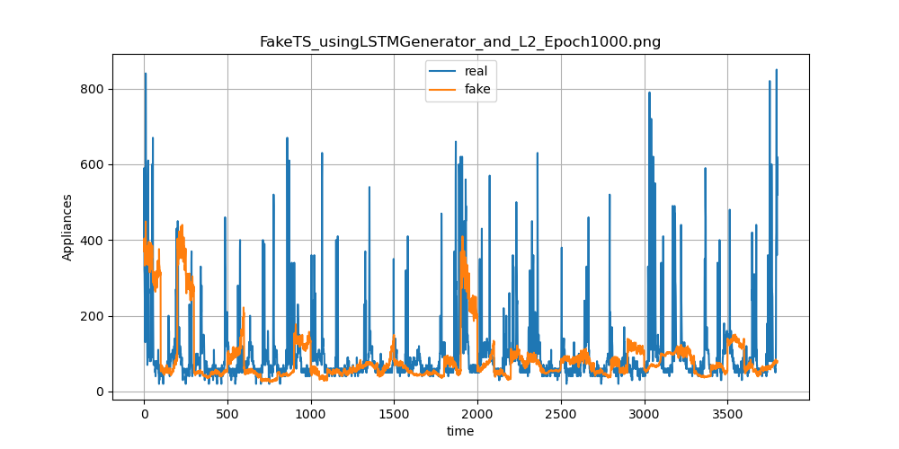
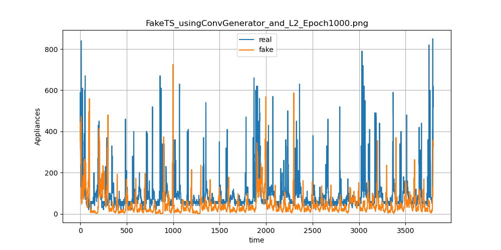

# Time-Series-Generation

### 0. Overview
This repository provides a simple project on time series generation using GAN and PyTorch. 

What this repository supports follows:

- Implementation of different models, **LSTM-based and Conv-based models**, for comparison
- Implementation of different loss functions, **L2 and WGAN-GP**, for comparsion
- Calculation of **metrics** proposed by **[TimeGAN](https://papers.nips.cc/paper/2019/hash/c9efe5f26cd17ba6216bbe2a7d26d490-Abstract.html) (NeurIPS 2019)** for quantitative evaluation

The performance seems to depend upon the characteristic of dataset and selection of hyper-parameters.

The dataset used here is **Appliances Energy Prediction Data Set** and can be found [here](https://archive.ics.uci.edu/ml/datasets/Appliances+energy+prediction).

### 1. Quantitative Evaluation

| Model | Predictive Score↓ | Discriminative Score↓ |
|:---:|:---:|:---:|
| LSTM-based Generator with L2 Loss | 0.0582 | N/A |
| Conv-based Generator with L2 Loss | 0.0466 | N/A |

The used metrics are simply adopted from the official repository of **[TimeGAN](https://github.com/jsyoon0823/TimeGAN) (NeurIPS 2019)**.

### 2. Qualitative Evaluation

| LSTM-based Generator with L2 Loss | Conv-based Generator with L2 Loss |
|:---:|:---:|
|  |  |

### 3. Run the Codes
#### 1) Prepare Data
Please place the file to `./data/` and specify `column` that you want to generate.

#### 2) Train
If you want to train Conv-based Generator with WGAN-GP loss,
```
python main.py --mode 'train' --model 'conv' --criterion 'wgangp'
```

To handle more arguments, you can refer to [here](https://github.com/hee9joon/Time-Series-Generation/blob/main/main.py#L262).

#### 3) Test
You can save plot and csv files then derive metrics on the test set. Please **install tensorflow 1.15** to obtain corresponding metrics.

```
python main.py --mode 'test'
```


### Development Environment
```
- Ubuntu 18.04 LTS
- NVIDIA GFORCE RTX 3090
- CUDA 10.2
- torch 1.6.0
- torchvision 0.7.0
- tensorflow 1.15
- etc
```
